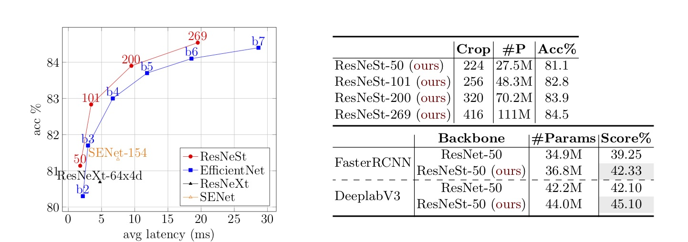

[](https://pypi.python.org/pypi/resnest)
[](https://pypi.org/project/resnest/#history)
[](https://github.com/zhanghang1989/ResNeSt/actions)
[](http://pepy.tech/project/resnest)
[](https://opensource.org/licenses/Apache-2.0)
[](https://github.com/zhanghang1989/ResNeSt/actions)
[](https://arxiv.org/abs/2004.08955)

[](https://paperswithcode.com/sota/instance-segmentation-on-coco?p=resnest-split-attention-networks)
[](https://paperswithcode.com/sota/object-detection-on-coco?p=resnest-split-attention-networks)
[](https://paperswithcode.com/sota/panoptic-segmentation-on-coco-panoptic?p=resnest-split-attention-networks)
[](https://paperswithcode.com/sota/semantic-segmentation-on-ade20k?p=resnest-split-attention-networks)
[](https://paperswithcode.com/sota/semantic-segmentation-on-cityscapes-val?p=resnest-split-attention-networks)
[](https://paperswithcode.com/sota/semantic-segmentation-on-pascal-context?p=resnest-split-attention-networks)


# ResNeSt
Split-Attention Network, A New ResNet Variant. It significantly boosts the performance of downstream models such as Mask R-CNN, Cascade R-CNN and DeepLabV3.



### Table of Contents
0. [Pretrained Models](#pretrained-models)
0. [Transfer Learning Models](#transfer-learning-models)
0. [Verify Backbone Models](#verify-backbone-models)
0. [How to Train](#how-to-train)
0. [Reference](#reference)


### Pypi / GitHub Install

0. Install this package repo, note that you only need to choose one of the options

```bash
# using github url
pip install git+https://github.com/zhanghang1989/ResNeSt

# using pypi
pip install resnest --pre
```

## Pretrained Models

|             | crop size | PyTorch | Gluon |
|-------------|-----------|---------|-------|
| ResNeSt-50  | 224       | 81.03   | 81.04 |
| ResNeSt-101 | 256       | 82.83   | 82.81 |
| ResNeSt-200 | 320       | 83.84   | 83.88 |
| ResNeSt-269 | 416       | 84.54   | 84.53 |

- **3rd party implementations** are available: [Tensorflow](https://github.com/QiaoranC/tf_ResNeSt_RegNet_model), [Caffe](https://github.com/NetEase-GameAI/ResNeSt-caffe).

- Extra ablation study models are available in [link](./ablation.md)

### PyTorch Models

- Load using Torch Hub

```python
import torch
# get list of models
torch.hub.list('zhanghang1989/ResNeSt', force_reload=True)

# load pretrained models, using ResNeSt-50 as an example
net = torch.hub.load('zhanghang1989/ResNeSt', 'resnest50', pretrained=True)
```


- Load using python package

```python
# using ResNeSt-50 as an example
from resnest.torch import resnest50
net = resnest50(pretrained=True)
```


### Gluon Models

- Load pretrained model:

```python
# using ResNeSt-50 as an example
from resnest.gluon import resnest50
net = resnest50(pretrained=True)
```

## Transfer Learning Models

### MMDetection

The ResNeSt backbone has been adopted by [MMDetection](https://github.com/open-mmlab/mmdetection/tree/master/configs/resnest).

### Detectron Models

Training code and pretrained models are released at our [Detectron2 Fork](https://github.com/zhanghang1989/detectron2-ResNeSt).

#### Object Detection on MS-COCO validation set


<table class="tg">
  <tr>
    <th class="tg-0pky">Method</th>
    <th class="tg-0pky">Backbone</th>
    <th class="tg-0pky">mAP%</th>
  </tr>
  <tr>
    <td rowspan="4" class="tg-0pky">Faster R-CNN</td>
    <td class="tg-0pky">ResNet-50</td>
    <td class="tg-0pky">39.25</td>
  </tr>
  <tr>
    <td class="tg-0lax">ResNet-101</td>
    <td class="tg-0lax">41.37</td>
  </tr>
  <tr>
    <td class="tg-0lax">ResNeSt-50 (<span style="color:red">ours</span>)</td>
    <td class="tg-0lax"><b>42.33</b></td>
  </tr>
  <tr>
    <td class="tg-0lax">ResNeSt-101 (<span style="color:red">ours</span>)</td>
    <td class="tg-0lax"><b>44.72</b></td>
  </tr>
  <tr>
    <td rowspan="5" class="tg-0lax">Cascade R-CNN</td>
    <td class="tg-0lax">ResNet-50</td>
    <td class="tg-0lax">42.52</td>
  </tr>
  <tr>
    <td class="tg-0lax">ResNet-101</td>
    <td class="tg-0lax">44.03</td>
  </tr>
  <tr>
    <td class="tg-0lax">ResNeSt-50 (<span style="color:red">ours</span>)</td>
    <td class="tg-0lax"><b>45.41</b></td>
  </tr>
  <tr>
    <td class="tg-0lax">ResNeSt-101 (<span style="color:red">ours</span>)</td>
    <td class="tg-0lax"><b>47.50</b></td>
  </tr>
  <tr>
    <td class="tg-0lax">ResNeSt-200 (<span style="color:red">ours</span>)</td>
    <td class="tg-0lax"><b>49.03</b></td>
  </tr>
</table>

#### Instance Segmentation


<table class="tg">
  <tr>
    <th class="tg-0pky">Method</th>
    <th class="tg-0pky">Backbone</th>
    <th class="tg-0pky">bbox</th>
    <th class="tg-0lax">mask</th>
  </tr>
  <tr>
    <td rowspan="4" class="tg-0pky">Mask R-CNN</td>
    <td class="tg-0pky">ResNet-50</td>
    <td class="tg-0pky">39.97</td>
    <td class="tg-0lax">36.05</td>
  </tr>
  <tr>
    <td class="tg-0lax">ResNet-101</td>
    <td class="tg-0lax">41.78</td>
    <td class="tg-0lax">37.51</td>
  </tr>
  <tr>
    <td class="tg-0lax">ResNeSt-50 (<span style="color:red">ours</span>)</td>
    <td class="tg-0lax"><b>42.81</b></td>
    <td class="tg-0lax"><b>38.14</td>
  </tr>
  <tr>
    <td class="tg-0lax">ResNeSt-101 (<span style="color:red">ours</span>)</td>
    <td class="tg-0lax"><b>45.75</b></td>
    <td class="tg-0lax"><b>40.65</b></td>
  </tr>
  <tr>
    <td rowspan="7" class="tg-0lax">Cascade R-CNN</td>
    <td class="tg-0lax">ResNet-50</td>
    <td class="tg-0lax">43.06</td>
    <td class="tg-0lax">37.19</td>
  </tr>
  <tr>
    <td class="tg-0lax">ResNet-101</td>
    <td class="tg-0lax">44.79</td>
    <td class="tg-0lax">38.52</td>
  </tr>
  <tr>
    <td class="tg-0lax">ResNeSt-50 (<span style="color:red">ours</span>)</td>
    <td class="tg-0lax"><b>46.19</b></td>
    <td class="tg-0lax"><b>39.55</b></td>
  </tr>
  <tr>
    <td class="tg-0lax">ResNeSt-101 (<span style="color:red">ours</span>)</td>
    <td class="tg-0lax"><b>48.30</b></td>
    <td class="tg-0lax"><b>41.56</b></td>
  </tr>
  <tr>
    <td class="tg-0lax">ResNeSt-200 (w/ tricks <span style="color:red">ours</span>)</td>
    <td class="tg-0lax"><b>50.54</b></td>
    <td class="tg-0lax"><b>44.21</b></td>
  </tr>
   <tr>
    <td rowspan="2" class="tg-0lax">ResNeSt-200-dcn (w/ tricks <span style="color:red">ours</span>)</td>
    <td class="tg-0lax"><b>50.91</b></td>
    <td class="tg-0lax"><b>44.50</b></td>
  </tr>
   <tr>
    <td class="tg-0lax"><b>53.30*</b></td>
    <td class="tg-0lax"><b>47.10*</b></td>
  </tr>
</table>

All of results are reported on COCO-2017 validation dataset. The values with * demonstrate the mutli-scale testing performance on the test-dev2019.

#### Panoptic Segmentation
<table class="tg">
  <tr>
    <th class="tg-0pky">Backbone</th>
    <th class="tg-0pky">bbox</th>
    <th class="tg-0lax">mask</th>
    <th class="tg-0lax">PQ</th>
  </tr>
  <tr>
    <td class="tg-0pky">ResNeSt-200</td>
    <td class="tg-0pky">51.00</td>
    <td class="tg-0lax">43.68</td>
    <td class="tg-0lax">47.90</td>
   </tr> 
</table>

### Semantic Segmentation

- PyTorch models and training: Please visit [PyTorch Encoding Toolkit](https://hangzhang.org/PyTorch-Encoding/model_zoo/segmentation.html).
- Training with Gluon: Please visit [GluonCV Toolkit](https://gluon-cv.mxnet.io/model_zoo/segmentation.html#ade20k-dataset).

#### Results on ADE20K

<table class="tg">
  <tr>
    <th class="tg-cly1">Method</th>
    <th class="tg-cly1">Backbone</th>
    <th class="tg-cly1">pixAcc%</th>
    <th class="tg-cly1">mIoU%</th>
  </tr>
  <tr>
    <td rowspan="6" class="tg-cly1">Deeplab-V3<br></td>
    <td class="tg-cly1">ResNet-50</td>
    <td class="tg-cly1">80.39</td>
    <td class="tg-cly1">42.1</td>
  </tr>
  <tr>
    <td class="tg-cly1">ResNet-101</td>
    <td class="tg-cly1">81.11</b></td>
    <td class="tg-cly1">44.14</b></td>
  </tr>
  <tr>
    <td class="tg-cly1">ResNeSt-50 (<span style="color:red">ours</span>)</td>
    <td class="tg-cly1"><b>81.17</b></td>
    <td class="tg-cly1"><b>45.12</b></td>
  </tr>
  <tr>
    <td class="tg-0lax">ResNeSt-101 (<span style="color:red">ours</span>)</td>
    <td class="tg-0lax"><b>82.07</td>
    <td class="tg-0lax"><b>46.91</b></td>
  </tr>
  <tr>
    <td class="tg-0lax">ResNeSt-200 (<span style="color:red">ours</span>)</td>
    <td class="tg-0lax"><b>82.45</td>
    <td class="tg-0lax"><b>48.36</b></td>
  </tr>
  <tr>
    <td class="tg-0lax">ResNeSt-269 (<span style="color:red">ours</span>)</td>
    <td class="tg-0lax"><b>82.62</td>
    <td class="tg-0lax"><b>47.60</b></td>
  </tr>
</table>

#### Results on Cityscapes

<table class="tg">
  <tr>
    <th class="tg-cly1">Method</th>
    <th class="tg-cly1">Backbone</th>
    <th class="tg-cly1">Split</th>
    <th class="tg-cly1">w Mapillary</th>
    <th class="tg-cly1">mIoU%</th>
  </tr>
  <tr>
    <td rowspan="3" class="tg-cly1">Deeplab-V3+<br></td>
    <td class="tg-cly1">ResNeSt-200 (<span style="color:red">ours</span>)</td>
    <td class="tg-cly1">Validation</td>
    <td class="tg-cly1">no</td>
    <td class="tg-cly1">82.7</td>
  </tr>
  <tr>
    <td class="tg-cly1">ResNeSt-200 (<span style="color:red">ours</span>)</td>
    <td class="tg-cly1">Validation</td>
    <td class="tg-cly1">yes</td>
    <td class="tg-cly1"><b>83.8<b></td>
  </tr>
  <tr>
    <td class="tg-0lax">ResNeSt-200 (<span style="color:red">ours</span>)</td>
    <td class="tg-0lax">Test</td>
    <td class="tg-cly1">yes</td>
    <td class="tg-0lax"><b>83.3<b></td>
  </tr>
</table>


## Verify Backbone Models:

**Note:** the inference speed reported in the paper are tested using Gluon implementation with RecordIO data.

### Prepare ImageNet dataset:

Here we use raw image data format for simplicity, please follow [GluonCV tutorial](https://gluon-cv.mxnet.io/build/examples_datasets/recordio.html) if you would like to use RecordIO format.

```bash
cd scripts/dataset/
# assuming you have downloaded the dataset in the current folder
python prepare_imagenet.py --download-dir ./
```

### Torch Model

```bash
# use resnest50 as an example
cd scripts/torch/
python verify.py --model resnest50 --crop-size 224
```

### Gluon Model

```bash
# use resnest50 as an example
cd scripts/gluon/
python verify.py --model resnest50 --crop-size 224
```

## How to Train

### ImageNet Models

- Training with MXNet Gluon: Please visit [Gluon folder](./scripts/gluon/).
- Training with PyTorch: Please visit [PyTorch Encoding Toolkit](https://hangzhang.org/PyTorch-Encoding/model_zoo/imagenet.html) (slightly worse than Gluon implementation).

### Detectron Models

For object detection and instance segmentation models, please visit our [detectron2-ResNeSt fork](https://github.com/zhanghang1989/detectron2-ResNeSt).

### Semantic Segmentation
 
- Training with PyTorch: [Encoding Toolkit](https://hangzhang.org/PyTorch-Encoding/model_zoo/segmentation.html).
- Training with MXNet: [GluonCV Toolkit](https://gluon-cv.mxnet.io/model_zoo/segmentation.html#ade20k-dataset).

## Reference

**ResNeSt: Split-Attention Networks** [[arXiv](https://arxiv.org/pdf/2004.08955.pdf)]

Hang Zhang, Chongruo Wu, Zhongyue Zhang, Yi Zhu, Zhi Zhang, Haibin Lin, Yue Sun, Tong He, Jonas Muller, R. Manmatha, Mu Li and Alex Smola

```
@article{zhang2020resnest,
title={ResNeSt: Split-Attention Networks},
author={Zhang, Hang and Wu, Chongruo and Zhang, Zhongyue and Zhu, Yi and Zhang, Zhi and Lin, Haibin and Sun, Yue and He, Tong and Muller, Jonas and Manmatha, R. and Li, Mu and Smola, Alexander},
journal={arXiv preprint arXiv:2004.08955},
year={2020}
}
```

### Major Contributors

- ResNeSt Backbone ([Hang Zhang](https://hangzhang.org/))
- Detectron Models ([Chongruo Wu](https://github.com/chongruo), [Zhongyue Zhang](http://zhongyuezhang.com/))
- Semantic Segmentation ([Yi Zhu](https://sites.google.com/view/yizhu/home))
- Distributed Training ([Haibin Lin](https://sites.google.com/view/haibinlin/))
